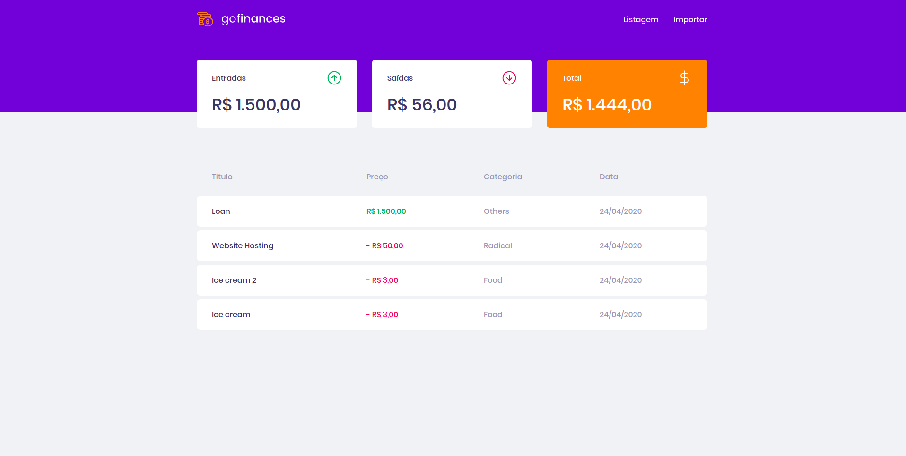
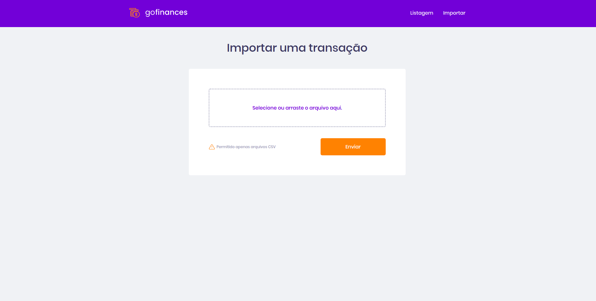

<h1 align="center">
  GoFinances Web
  <br /> <br />
  
  <br /> <br />
  
</h1>

# Indice
- [React](#-React)
- [Tecnologias utilizadas](#-Tecnologias-utilizadas)
- [Como baixar o projeto](#-Como-baixar-o-projeto)

## React

Nesse **desafio 07**, foi criado uma aplicação para mostrar a gestão de transações, praticando mais sobre o **ReactJs** junto com **TypeScript**, utilizando rotas e envio de arquivos por formulário.

É uma aplicação que se conectar no backend do Desafio 06, e exibir as transações criadas e permitir a importação de um arquivo CSV para gerar novos registros no banco de dados.

---

## Tecnologias utilizadas

O projeto foi desenvolvido utilizando as seguintes tecnologias

- ReactJS
- Axios
- TypeScript
- React-Dropzone
- Filesize
- Styled-Components
- Date-fns
- History
- Polished
- ReactIcons.

---
## Como baixar o projeto


```bash

  # Clonar o repositório
  $ git clone https://github.com/DevTeles/GoFinances-Web-Desafio-07-.git

  # Entrar no diretório
  $ cd GoFinances-Web-Desafio-07-

  # Instalar as dependências
  $ yarn

  # Start no pasta do projeto do backend (defasio 06)
  $ yarn dev

  # Iniciar o projeto
  $ yarn start
```

<br /><br />
Desenvolvido por **Rafael Teles Vital**
